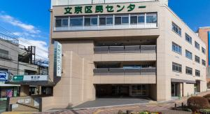
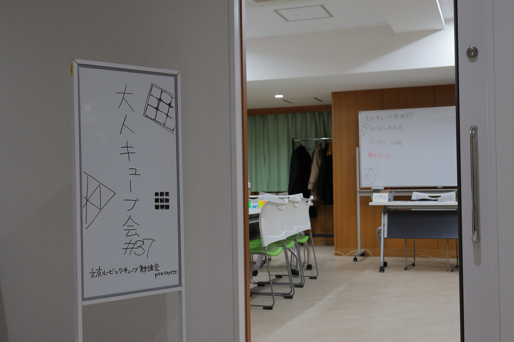
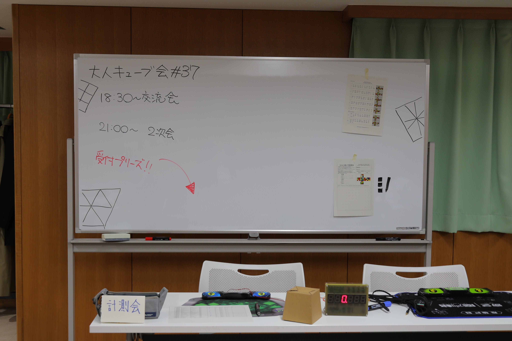

## 概要
### 日時
**2020/1/10(金) 18:30-20:30**

| 時間        | 内容             |
| ----------- | ---------------- |
| 18:00-18:30 | 会場設営         |
| 18:30-20:45 | 交流会など       |
| 20:45-20:50 | 片付け、原状回復 |
| 21:00-23:00 | 二次会           |

### 会場
文京区民センター(2-B会議室)  
住所：文京区本郷4-15-14

### その他
- [イベントページ - Connpass](https://otonarubik.connpass.com/event/161023/)

## 内容
1/10(金)に「大人のためのキューブ勉強会#37」を開催しました。**運営メンバーが変わってから初めての実施であり、年初の忙しい時期の開催にも関わらず、多数の方にご参加いただきまして、ありがとうございました！**今後も継続的に実施をしていきたいと思いますので、次回の目途が立ち次第、改めて告知させていただきます。また、大人キューブ会に関するご意見、ご感想、ご不満、ご賞賛、そのほかありましたら、お知らせください。次回以降の改善点とします。



### 交流会
**19名の方にご参加いただきました。20代の参加者も多く、これまでの大人キューブ会よりは参加者が若い印象だったように思います。**大きなトラブルもなく、当初想定していた「平日の仕事帰りに大人キューバーが集まって交流する」という会の目的は達成できたように思います。

24名の申し込みに対して19名に参加いただきました。当初20名の定員で申し込みを開始しましたが、満員となったため、急遽定員を25名に拡張しました。初回から盛況な開催となり、主催者の一人として非常に嬉しく感じました。参加費は当日現金にて回収しました。手元にあったキューブバッグに入れて回収するようにしましたが、次回は別途封筒を用意しておくとよいでしょう。

{: width="500px" height="auto" class="img-responsible align-center"}

**会場として利用したのは、文京区民センターでした。**鍵を借り受けるのではなく、受付付近の守衛室に声をかけて解錠いただく形式でした。18時ごろより設営を開始し、何名か有志の方にお手伝いいただきながら、5分程度で会場の設営が完了しました。テーブルをロの字に配置したものを、部屋の左右にそれぞれ設置し、交流スペースとしました。会場中央のホワイトボードの前に計測会スペースを設けました。

ジャッジ用の座席を配置すると、部屋の左右を移動するための動線を塞いでしまったため、次回はもう少しレイアウトに考慮が必要だと感じました。部屋自体は非常にきれいで明るく、キューブ会を行うには十分すぎる環境でした。また、机のレイアウト配置などの現状復元図もあらかじめ備え付けてあったため、設営・撤去ともにスムーズに実施できました。費用も安価で、とてもよい会場です！

{: width="500px" height="auto" class="img-responsible align-center"}

{: width="500px" height="auto" class="img-responsible align-center"}

**冒頭に自己紹介タイムを設け、参加者の「名前」「今年の目標」「好きなキューブ」をそれぞれ1分以内で発表していただきました。**初参加者もいたため、それぞれどんな人が参加しているのかを知ってもらうために行いました。ファシリテーションにおけるアイスブレイクの効果を狙いましたが、20分強の時間がかかってしまったので、もう少し工夫をして実施すべきであったと感じました。

これまでの大人キューブ会では「自己紹介」という時間を取ることはほぼなく、時間になったら参加者は黙々とキューブを回したり交流をしたりする、というのが多かったように思います。参加者間の交流を促進するためのツールとして、自己紹介機能つきの名札を採用してもよかったかもしれません。

**計測会は公式大会と同じ形式での計測を行いました。** スクランブル自体はホワイトボードにも掲示しておいて、「自分でできる方は自分でやってね」という形式にしました。スクランブル（同じもの）を2部印刷しておいたのは、こういう形で測会を実施する上で非常に便利でした。事前に申し込みのあった参加者については記録用紙を印刷し、準備しておきました。

スクランブルを使って自分で計測した人はかなり少なく（1名のみ）、大会形式での計測が大半でした。ジャッジつきで計測するほうが大会感があって面白いのでしょうか？　**記録用紙を印刷しておくと、参加者におみやげとして持って帰ってもらえる**という効果がありますが、大会経験者にとってはどれほどの魅力があるかは不明です。

関西で実施しているキューブミーティングなどでは、公式大会と同様のフォーマットで計測を行い、記録証を発行しておみやげとして持って帰ってもらう、ということを何度が実施されたことがあるようです。フォーマット準備、印刷対応など運用コストはそれなりにかかってしまいますが、初心者のキューバーにとっては魅力があるのかもしれません。

「観客席との距離」「スクランブラ」に関する条件以外は、ほぼWCA競技規則に準拠した形で実施しました。公式大会の経験があまりない方、未経験者に対して、こういうルールでやるんですよ、ということをお伝えできるのはよい点だったように思います。

{: width="500px" height="auto" class="img-responsible align-center"}

また、**トーナメントディスプレイの代替として、参加者による自作のディスプレイ装置（インスペクションタイムの計測機能付き）を利用しました。**インスペクションタイムの8秒と12秒のときに自動でブザーが鳴る機能があり、ジャッジをする上でも非常に楽でした！  
初めて見る参加者は特に興味津々で、実際に触って動作を確認したり仕組みを開発者に伺ったりしていました。今後も常にお持ちいただけるかはわからないので、別途ストップウォッチ買っておいてもよいかもしれません。

計測用にキューブカバー持っていきました。残念ながらクロックだけは入らないサイズでしたが、普通に実用できます。

{: width="200px" height="auto" class="img-responsible align-center"}

**印刷した記録用紙に記録を書いてサインしてもらうように進めましたが、この動作に時間を取られたかもしれません。**競技者がサインをしている間に、キューブを回収して次のスクランブルを回すことができたので、効率的に進められたように思います。しかし、主催者が一人でスクランブラ＋ジャッジを兼任しながら進めていくのは非常に負担が大きいため、次回以降やり方を別途検討します。

スタックタイマーを直接スマートフォンと接続し、csTimerで記録を取得するようにすれば、自動化できてよいかもしれません。二次会の会場では1名この方式で計測を行いましたが、非常にスムーズにできました。

### 二次会
**15名の方にご参加いただきました。**大人キューブ会は交流会と同じくらい二次会が楽しいということを久しぶりに実感できました。交流会と二次会に同時参加すると大人キューブ会を100%楽しめる！と思っていますが、時間のない方はどちらかだけの参加も受け付けております。（二次会だけ参加したい、とかも可）

上記のスケジュールの通り、会議室を取って交流会を行っている時間は2時間強でしたが、その後に二次会を2時間行っているので、**実質4時間強ずっとキューバーと交流ができるイベントになりました。つまり、13:00-17:00のイベントに相当します。すごい密度！**

## 計測会
### 参加者
12名の計測を行いました。スクランブラおよびジャッジは、私(@kawam1123)が実施しました。上にも書いたとおり、**一人でスクランブラとジャッジを兼任しつつ、競技卓1つでずっと回すのは不可能である**と感じました。タイマーが複数あれば、参加者間で相互にスクランブル＋ジャッジをして計測し、記録用紙に記録いただいた上で提出いただくなど、工夫をすることができると思いました。
### 結果
同じ結果とスクランブルを[connpassのイベントページ](https://otonarubik.connpass.com/event/161023/)にも載せています。どう管理していくかはこれから考えましょう。

| 参加者名       | 1     | 2     | 3     | 4     | 5     | Single | Average|
| -------------- | ----- | ----- | ----- | ----- | ----- | ------ | ----- |
| uesyuu         | 9.14  | 10.36 | 10.52 | 10.46 | 10.54 | 9.14   | 10.45 |
| Morooka        | 16.70 | 12.72 | 13.50 | 11.95 | 16.31 | 11.95  | 14.18 |
| yazawa3x3      | 15.56 | 14.18 | 13.96 | 15.38 | 24.44 | 13.96  | 15.04 |
| 白             | DNF   | 15.15 | 13.80 | 14.23 | 16.15 | 13.80  | 15.18 |
| xingfu_da      | 17.59 | 18.63 | 20.22 | 14.69 | 17.86 | 14.69  | 18.03 |
| SatoruUmetsu   | 21.54 | 21.80 | 17.09 | 15.26 | 18.24 | 15.26  | 18.96 |
| Phitan_Cube    | 18.85 | 24.59 | 21.36 | 15.84 | 17.07 | 15.84  | 19.09 |
| kits_          | 26.88 | 25.14 | 24.81 | 17.13 | 25.66 | 17.13  | 25.20 |
| _anrt8116      | 29.60 | 27.23 | 21.68 | 25.26 | 24.76 | 21.68  | 25.75 |
| ニオウダチスト | 26.81 | 23.22 | 32.64 | 29.08 | 19.61 | 19.61  | 26.37 |
| favo_machine_  | 22.43 | 45.24 | 27.37 | 29.28 | 34.90 | 22.43  | 30.52 |
| T・Noguchi     | 46.42 | 45.90 | 45.64 | 33.86 | 42.63 | 33.86  | 44.72 |
{: .table-striped .table-sm}

### スクランブル
1. `R' B U D L F D' R' U F U2 B' U2 D2 F L2 B L2 F' R2`
1. `L2 B2 D2 R' F2 L U2 B2 L F U B2 D' L U2 F2 L2 U' L B2`
1. `B2 L' F2 D2 R D2 L' U2 R' B' D L' U' R' D2 B' L R2 B2 F'`
1. `R2 B2 F2 U2 F2 R2 U' R2 U2 F2 U2 F D2 R' F' D2 F' L' F2 D`
1. `D2 B2 F2 L2 F2 R2 U B2 U' F' U2 L F' L' U2 L D' U' R U`

## その他運営に関する覚書
### 集客
Twitter公式アカウントでの告知、個人アカウントでの告知、および過去の参加者に対してはconnpass経由で通知メール送付などで集客を行いました。当日のキャンセルの可能性、部屋のキャパシティ、運営コストなどを考えると、おおむね25名程度を定員するのがよいように思います。

### フィードバック
参加者からのフィードバックを得る方法を別途考えます。Twitter上で「大人キューブ会」のエゴサーチをするほか、個別にご感想を伺っています。人数があまり多くないので、定量的なフィードバックを得るよりも、それぞれの参加者からのナラティブを聞き取ったほうが有益な結果になると思っています。

### 次回開催
大人キューブ会#38は、いまのところ**2/21(金)**の開催を予定しています。詳細決まりましたら、また告知ページ作ります。