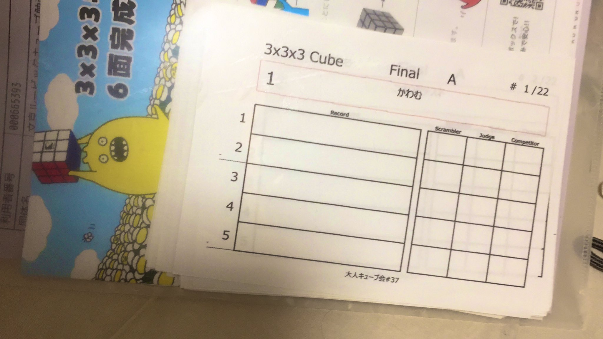
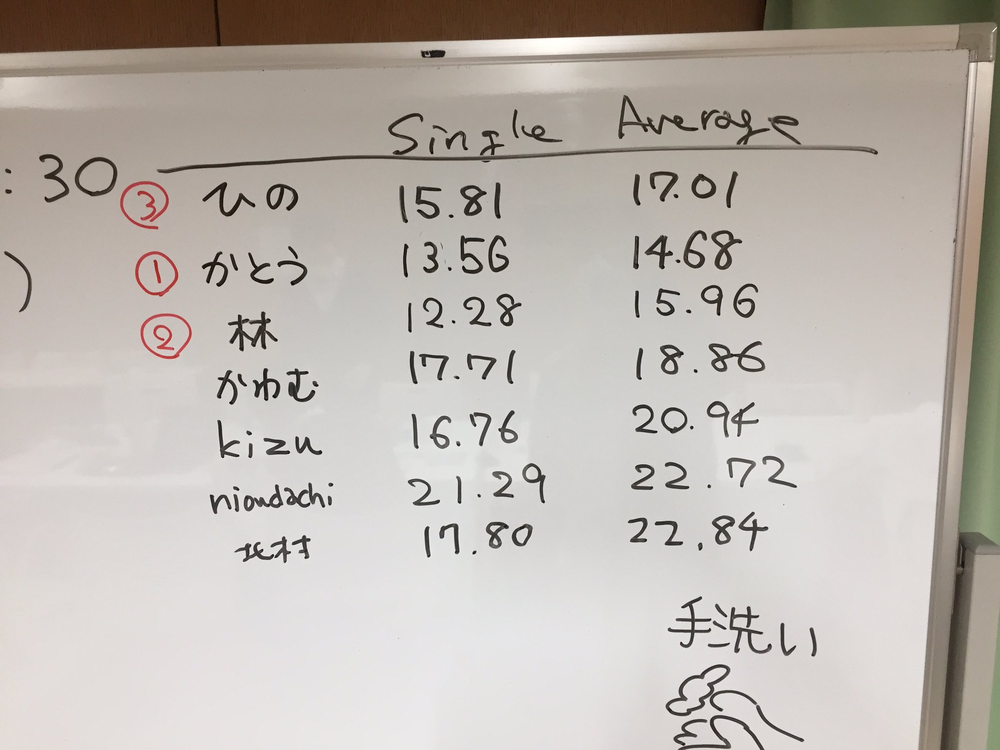
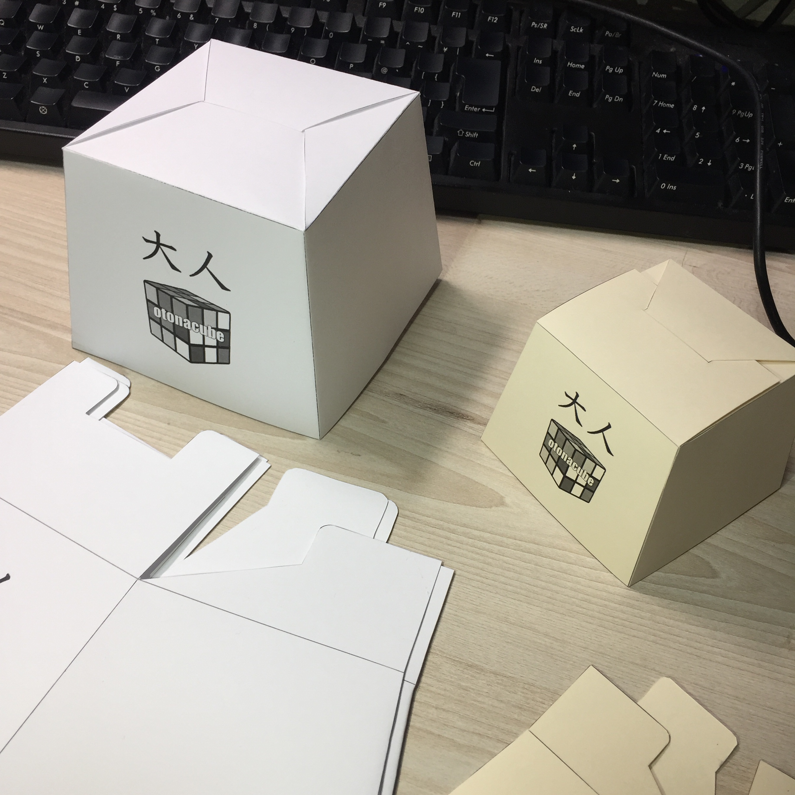
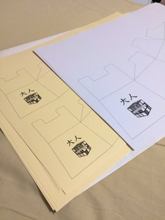
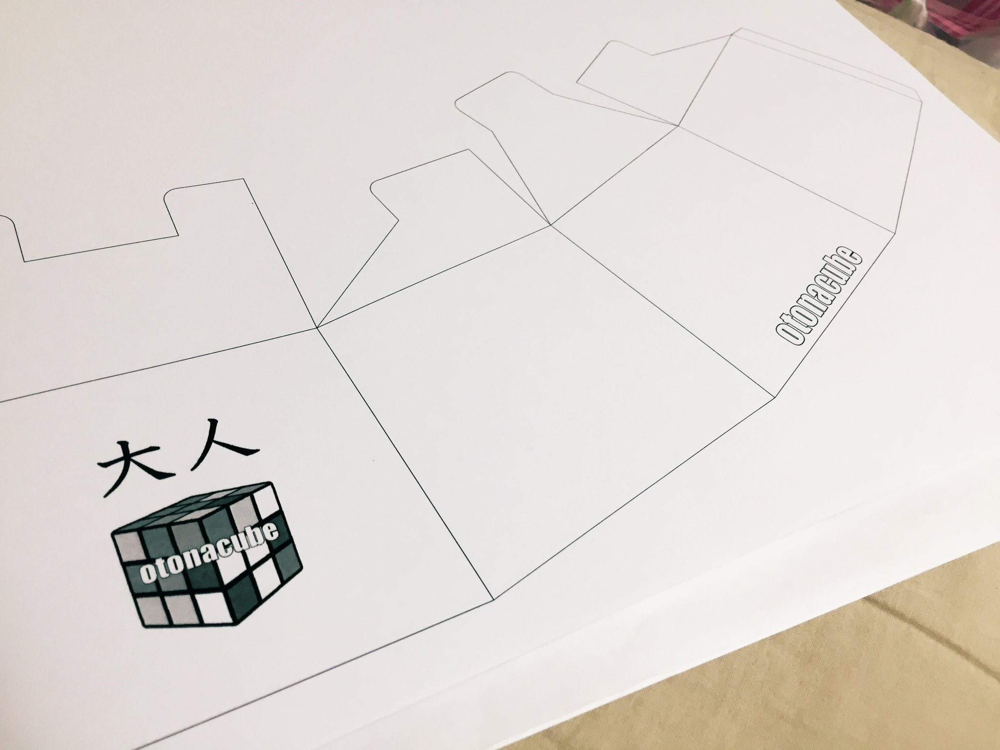


## 概要
### 日時
**2020/2/21(金) 18:30-20:30**

| 時間        | 内容             |
| ----------- | ---------------- |
| 18:00-18:30 | 会場設営         |
| 18:30-20:30 | 交流会など       |
| 20:30-20:45 | 片付け、原状回復 |
| 21:00-23:00 | 二次会           |

### 会場
文京区民センター(2-B会議室)  
住所：文京区本郷4-15-14

### その他
- [イベントページ - Connpass](https://otonarubik.connpass.com/event/162676/)

## 内容
2/21(金)に「大人のためのキューブ勉強会#38」を開催しました。感染症予防のためや仕事の都合などで様々な要因が重なって、キャンセルの多い回でした。10人弱でこじんまりとやるのも楽しいものでした。 **お忙しい中ご参加いただいた皆様、ありがとうございました！** 過去の開催履歴から考えると、10人～15人程度がコンスタントに参加する形で続けていけるのかな、と思っています。

### 交流会
**9名の方にご参加いただきました。初参加者の方は1名いらっしゃいました。**

申込時点では18名の参加希望をいただいていましたが、様々な事情で9名の方にキャンセルをいただきました。大人キューブ会はその性質から「当日仕事の都合がつかずに来れなくなった／遅れることがわかった」「翌日急な出張が入った」などの事情でのキャンセルが出ることが多くあると思います。大人ですからね！　参加者募集や運営費用なども、そういったキャンセルを見込んだうえで考えていますので、特に困ることはありませんでした。

交流会で見聞きした面白そうな話題を雑多に箇条書きしておきます。

- **綾瀬記録会2020に参加された方、お疲れ様でした。** 自己記録を更新するなど楽しく参加した方が多かったようです。
- **お試し用としてTraxxass Diff Oilの10k/30kを持参しました。** キューブの回転が重くなって安定するので、DaYan TengYunなどに入れると非常によいキューブになります。何名かの方にお試しいただいて、好評でした。
- Square-1上級者の滑らかな指使いを拝見する。U/D面が魔法のように動いてすごい。
- Square-1の磁石はU/Dのみが好みの人も、そうでない人もいる。
- まだキューブを初めて1か月だけれど頑張ってOLL/PLL手順を増やすぞ！という参加者がいらっしゃって、非常に嬉しく思いました。
- **キューブを貸し借りすることが多いので、その前後には手洗い／除菌シートで拭くなどを奨励しました。小さな集まりですが、予防できるところはちゃんと対策しましょう。** 
- 同じ建物にある大会議室(2A会議室)、広くて綺麗なので大会に使えるのでは。大会やりたいですね。
- 回転パズルの解法をまとめた同人誌を作成してる方がいらっしゃった。すごい。
- 二次会では明日から使える（かもしれない）効率的なF2L講座が開かれました。UFRコミューテータを使ったF2L手順など非常に面白かったです。

### 二次会
**7名の方にご参加いただきました。** お店は前回と同じでした。二次会のみの参加も歓迎です！交流会には仕事が間に合わなくて参加できないけれど、二次会は行けるぞ！という方は個別にご連絡ください。

## 計測会
**計測会のやり方を前回から変更しました。** 前回同様、記録用紙を事前に印刷しておきましたが、参加者の名前などは特に書かれていない空欄のものにしました。(参考までに前回の記録用紙の画像を載せます）
{: width="500px" height="auto" class="img-responsible align-center"}

**あらかじめAパタン/Bパタンのスクランブルを容易しておき、参加者同士で相互スクランブル／ジャッジで計測をしていただくようにしました。** 計測終了後、記録用紙を提出いただき、単発と平均のタイムのみホワイトボードに書きました。全てのタイムをホワイトボードに書くとけっこう大変だろうと思います。あらかじめExcelシートを用意しておき、そこに記録を入力することで単発と平均を自動計算しました。これはなかなか楽でした。

{: width="500px" height="auto" class="img-responsible align-center"}

{: width="500px" height="auto" class="img-responsible align-center"}

**計測会での記録上位３名には景品を進呈しました。** 今回用意したのはこんな景品です。1000円以下で「もらったらちょっと嬉しいかもしれない」くらいのところを景品にしていこうかなと思っています。今後の景品の希望などあればアイディアください！
- [QiYi Dino Cube Stickerless](https://store.tribox.com/products/detail.php?product_id=2609)
- [TheCubicle DNM-37](https://store.tribox.com/products/detail.php?product_id=2864)
- [YJ Cube Bag 1](https://store.tribox.com/products/detail.php?product_id=2715)

次回以降、**大人キューブ会の計測会での自己ベスト記録からの伸び率が高い順にランキングをつけて、上位数名に景品をプレゼントする形にしようかと考えています。** 今回は平均タイムの速い方の上位３名にしましたが、この方式だとsub-10キューバーが参加すると景品が全てその方に行ってしまうので、あまり大人キューブ会っぽくないだろうと想定しています。大人キューバーもちゃんと練習すればタイム伸びるのです。そして初心者ほどタイムの伸び率は高いのですから、この方式なら「前回の開催からの一か月間、頑張って練習した初心者」に景品がなるべく行く方式になることを期待しています。

また、今回は全参加者にプレゼントとして、**大人キューブ会「キューブカバー」**をお渡ししました。
{: width="500px" height="auto" class="img-responsible align-center"}

以前[キューブカバー用に図面を作成していたもの](../cubecover.html)があるので、これベースに大人キューブ会のロゴを入れた手作り品となっています。無配の限定品です。ピラミンクス、クロック以外は入ると思います。 **折りたたむとコンパクトになるので、A4クリアファイルなどに入れて持ち歩くことができます。** 外出先や自宅などでの計測や目隠し練習の際にご利用ください。厚めの用紙(153.5g/m2)に印刷していますので、組み立ててから中にキューブを入れても問題ない程度の強度はあります。

{: width="500px" height="auto" class="img-responsible align-center"}

{: width="500px" height="auto" class="img-responsible align-center"}

### 結果
同じ結果を[connpassのイベントページ](https://otonarubik.connpass.com/event/162676/)にも載せています。

|参加者名|#1|#2|#3|#4|#5|Single|Average|
|---------|---|---|---|---|---|------|-------|
|かとう|14.83|13.56|14.51|14.71|18.57|13.56|14.68|
|hayasi|16.77|12.28|26.88|13.91|17.20|12.28|15.96|
|sunfield1128|17.77|15.81|27.72|16.01|17.24|15.81|17.01|
|かわむ|20.82|17.71|18.93|18.16|19.49|17.71|18.86|
|kizu11|22.00|22.62|16.76|20.61|20.21|16.76|20.94|
|ニオウダチスト|22.24|28.06|21.29|21.68|24.25|21.29|22.72|
|kits_|23.58|24.91|20.39|24.56|17.80|17.80|22.84|
{: .table-striped .table-sm}

## その他運営に関する覚書
### 集客
**Twitter公式アカウントでの告知、個人アカウントでの告知、および過去の参加者に対してはconnpass経由で通知メール送付などで集客を行いました。** 大人キューブ会のLINEグループがあるので、こちらでも告知するのを忘れないようにします。入りたい方は個別にお知らせください。

### 次回開催
大人キューブ会#39は3月末ごろ開催予定です。詳細決まりましたら、また告知ページ作ります。