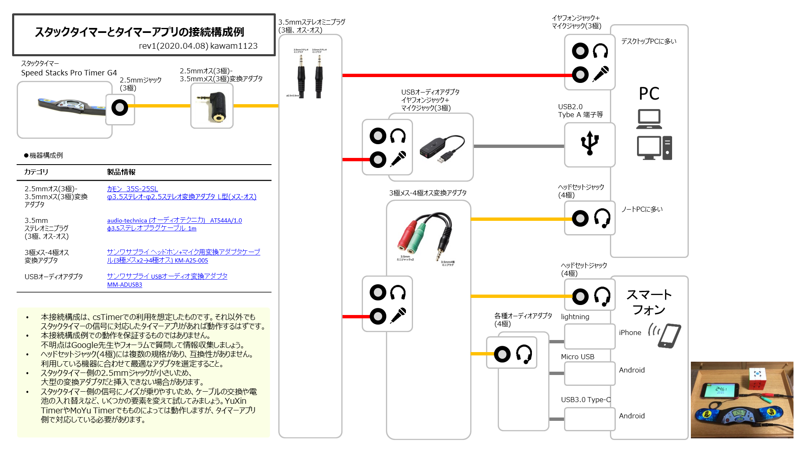
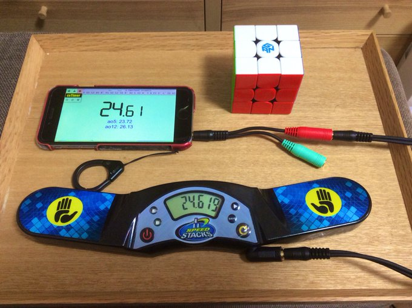
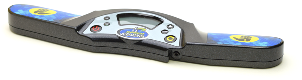
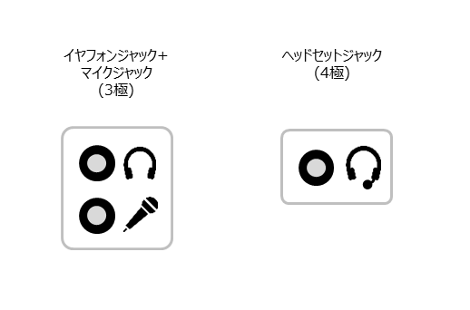

# スタックタイマーをcsTimerに接続するには

## TL;DR;
スタックタイマーをPC/スマートフォンに接続し、タイム入力を連携させるための接続構成例を紹介します。csTimerへの接続を想定した構成です。[うえしゅうさんのブログ記事](https://uesyuu.com/blog/?p=448)だけ読めば十分です。

## 本記事を読んでできるようになること
- スタックタイマーをPCやスマートフォンに接続するための機器構成がわかる
- スタックタイマーをcsTimerなどのタイマーアプリの入力デバイスとして利用できるようになる
- タイム手入力の苦痛から開放されるので、スピードキューブがもっと楽しくなる

## 接続構成図
PCおよびスマートフォンへの接続のために、想定される接続構成例をまとめました。下記の画像で一通りのことはわかると思います。

{: width="auto" height="auto" class="img-responsible align-center"}

### iPhoneにつないでみた場合
{: width="auto" height="auto" class="img-responsible align-center"}

### 注意書き
- 本接続構成は、csTimerでの利用を想定したものです。それ以外でもスタックタイマーの信号に対応したタイマーアプリがあれば動作するはずです。
- 本接続構成例での動作を保証するものではありません。不明点はGoogle先生やフォーラムで質問して情報収集しましょう。
- ヘッドセットジャック(4極)には複数の規格があり、互換性がありません。利用している機器に合わせて最適なアダプタを選定すること。
- スタックタイマー側の信号にノイズが乗りやすいため、ケーブルの交換や電池の入れ替えなど、いくつかの要素を変えて試してみましょう。YuXin TimerやMoYu Timerでもものによっては動作しますが、タイマーアプリ側で対応している必要があります。
{: .notice}

## 機器構成
インフォグラフィックに示した要素を詳細に解説していきます。

接続に利用した機器の構成例を示します。

| カテゴリ| 製品情報|
| -------------------------------------- | ------------------------------------------------ |
| スタックタイマー | [SpeedStack Stackmat Timer G4](https://store.tribox.com/products/detail.php?product_id=1762) |
| 2.5mmオス(3極)-3.5mmメス(3極)変換アダプタ| [カモン 35S-25SL φ3.5ステレオ-φ2.5ステレオ変換アダプタ L型(メス-オス)](https://www.sengoku.co.jp/mod/sgk_cart/detail.php?code=4ASG-MMG3)|
| 3.5mmステレオミニケーブル                | [audio-technica (オーディオテクニカ)　AT544A/1.0 φ3.5ステレオプラグケーブル　(3極、オス-オス) 1m](https://www.audio-technica.co.jp/product/AT544A)|                                                                              |
| 3.5mm 3極メス-4極オス変換アダプタ     | [サンワサプライ ヘッドホン+マイク用変換アダプタケーブル(3極メスx2→4極オス) KM-A25-005](https://www.sanwa.co.jp/product/syohin.asp?code=KM-A25-005) |
| USBオーディオアダプタ      | [サンワサプライ USBオーディオ変換アダプタMM-ADUSB3](https://www.sanwa.co.jp/product/syohin.asp?code=MM-ADUSB3)|
| 各種変換ケーブル（スマートフォン向け） | (任意)|

### スタックタイマー
スタックタイマーはWCA公式大会に利用されている [**SpeedStack Stackmat Timer G4**](https://store.tribox.com/products/detail.php?product_id=1762)の利用を想定します。トーナメントディスプレイに出力するために2.5mmステレオミニジャック(3極)が装備されているため、このジャックを利用して信号を取得します。**製品のタッチセンサー自体が非常にノイズに弱い**ため、個体差によって正常に動作しない場合があります。また、出力電圧が不安定であることが多く、新しい電池に交換することで正常に動作する場合があります。

{: width="auto" height="auto" class="img-responsible align-center"}
Speed Stacks Pro Timer G4 (Tribox)
{: .text-center}

また、信号に互換性のあるタイマーであれば問題なく動作します。機種によって一部出力電圧が異なったりする場合がありますので注意してください。
- Speed Stacks Pro Timer G3
- Speed Stacks Pro Timer G4
- YuXin Timer
- NyanTimer/NyanTimer2 (公式タイマーの信号に準拠するため利用できるはず)

MoYuTimerのみ出力されるビット列が異なるため、タイマーアプリ側での信号補正が必要となります。csTimerはMoYuTimerの信号を補正するオプションがあるので対応しています。

### オーディオケーブル
- **スタックタイマーからの信号は音声信号として出力されます。** ((RS-232C準拠のシリアル信号として出力されます))
- **スタックタイマーは2.5mmステレオマイクロジャック(3極)を備えています。** PCやスマートフォンなどに接続するためには、まずプラグの太さを変換する必要があります。2.5mm(オス)→3.5mmメスの変換アダプタを用意しましょう。
- スタックタイマー側の2.5mmジャックが小さいため、大型の変換アダプタだと挿入できない場合があります。[カモンのL型アダプタ](https://www.sengoku.co.jp/mod/sgk_cart/detail.php?code=4ASG-MMG3)や、Y型コネクタなどがオススメです。
- **2.5mm(3極、オス)-3.5mm(3極、オス)というケーブルもありますから、こちらを使ってもよいでしょう。** ケーブル長の選択肢が少ないため、私は3.5mmステレオミニプラグと組み合わせて利用しています。
- 3.5mmステレオミニプラグ(3.5mm、オス-オス)は比較的調達しやすいものです。利用環境に合わせて好きな長さを選択してください。短いもののほうがノイズは乗りにくいです。（10mなどにしなければあまり影響はないと思いますが）
- **「3極とか4極って何？」**という人は[こちら](https://www.phileweb.com/review/article/201505/01/1623.html)を見るとよいでしょう。

### デバイス (PC/iPhone/Android)
PCやスマートフォンに標準でついているオーディオデバイスには、大きく次の二種類があります。

1. **イヤホンジャック＋マイクジャック(3極)** : それぞれが独立した3.5mmのジャック。端子は3極。デスクトップPCに多い。
1. **ヘッドセットジャック(4極)** : マイクとスピーカーが1つのジャックにまとまったもの。端子は4極。ノートPCに多い。また、スマートフォンに備えられている場合が多い。

{: width="500" height="auto" class="img-responsible align-center"}

独立したマイクジャック(3極)がある場合、イヤホンジャックとマイクジャックを間違わないように挿入すれば接続は完成です。ヘッドセットジャック(4極)がある場合、スタックタイマーの出力信号をマイクとして認識させるために、[3極プラグ-4極プラグの変換アダプタ](https://www.sanwa.co.jp/product/syohin.asp?code=KM-A25-005)が必要となります。このサンワサプライの製品の場合、赤がマイク入力となるため、スタックタイマーからのケーブルを赤に挿入します。

{: width="300" height="auto" class="img-responsible align-center"}

- オーディオデバイスがついていない／利用できない場合、USB接続のオーディオ変換アダプターを利用してもいいでしょう。
- iPhoneやAndroidなどでオーディオジャックがなく、LightningやUSB-Cなどの端子しかない場合、[ヘッドフォンジャックアダプタ](https://www.apple.com/jp/shop/product/MMX62J/A/lightning-35-mm%E3%83%98%E3%83%83%E3%83%89%E3%83%95%E3%82%A9%E3%83%B3%E3%82%B8%E3%83%A3%E3%83%83%E3%82%AF%E3%82%A2%E3%83%80%E3%83%97%E3%82%BF)などを使って接続することができます。
- スマートフォンの機種によっては、入力された音声信号を人間の可聴域に合わせて補正するものがあります。これによって正常に動作しない場合がありますのでご注意ください。

## タイマーアプリの設定 (csTimer)
ここまでの機器構成に従って接続することで、準備は完了です。次にタイマーアプリ側の設定をしましょう。
### オーディオデバイスの設定
PCやMacで接続する場合、デフォルトのオーディオデバイスとしてミニジャックからの入力を選択しないと動作しない場合があります。複数のオーディオデバイスがある場合は注意しましょう。

### csTimerの設定
次の手順で接続します。
1. **ブラウザでcsTimerにアクセスします。** PC/Macでは、Google Chromeの最新版を利用することをお勧めします。スマートフォンではSafariやChromeなどを使ってください。また、csTimerへの接続時にはHTTPS接続([https://cstimer.net](https://cstimer.net) )していることを確認しましょう。HTTP接続ではブラウザがオーディオデバイスを利用できないためです。
1. [オプション]>[タイマー]>[タイム入力方式]から[スタックマット]を選択します。
1. オーディオデバイスの利用許可を求めるポップアップが表示されるため、[許可]を選択します。
1. **スタックタイマーの電源を入れます。** 画面上に0:00などの表示が出ていれば正常に接続できています。

{: width="auto" height="auto" class="img-responsible align-center"}

- [ツール]>[stackmat]から信号の取得状況を確認できます。オーディオデバイスがミニジャックからの入力になっていることを確認しましょう。

### その他のタイマーアプリ
- Prisma Puzzle timer (PPT)でも動作するはずです。
- CubingTime.comにもスタックタイマー互換性があるらしいので、動作しそうです。（未検証）

## その他のわかりやすい解説記事など
### スタックタイマーとcsTimerの繋げ方 - uesyuu's Blog
**うえしゅうさんよる解説記事。** 非常に簡潔にまとまっておりわかりやすい。正直、日本語記事ではここだけ読めば問題ない。

[スタックタイマーとcsTimerの繋げ方 - uesyuu's Blog](https://uesyuu.com/blog/?p=448)

### cyotheking (Chris Olson)
**スタックタイマーとMacを接続するための解説動画。** コミカルな語り口であり、必要な事項をすべて網羅しており、わかりやすい。英語に抵抗のない方は、ここだけ見れば問題ない。



<blockquote class="twitter-tweet">
「スタックタイマーとタイマーアプリの接続構成例」のインフォグラフィックを作成しました。機器構成のためのケーブル／アダプタについて基本的なことだけ記載。とりあえずrev1。  スタックタイマーをPCやスマートフォンと接続して、無限スピードキューブできます。<a href="https://twitter.com/hashtag/%E3%82%B9%E3%82%BF%E3%83%83%E3%82%AF%E3%82%BF%E3%82%A4%E3%83%9E%E3%83%BC%E7%B9%8B%E3%81%8C%E3%81%A3%E3%81%9F%E3%82%88?src=hash&amp;ref_src=twsrc%5Etfw">#スタックタイマー繋がったよ</a> <a href="https://t.co/roOM22GoYw">pic.twitter.com/roOM22GoYw</a>
&mdash; かわむ (@kawam1123) <a href="https://twitter.com/kawam1123/status/1247896262269005827?ref_src=twsrc%5Etfw">April 8, 2020</a></blockquote> 

## 技術的な解説記事など
スタックタイマーの出力信号や接続方式に関する技術的な要素に興味のある方は、次の記事を参照してください。

### 信号解析に関するもの
- [Stackmat Viewer by Stefan Pochmann](https://www.stefan-pochmann.info/misc/stackmat/) : Stefan Pochmanによるスタックタイマーの信号解析。信号解析用のアプリケーションを開発していました。矩形波としてビット列を伝送していることがわかり、信号の内容が非同期シリアル通信であるRS-232Cに準拠したものであることがわかります。
- [スタックタイマーの信号について(@Nyanyan_Cube) - Qiita (2020)](https://qiita.com/Nyanyan_Cube/items/e517e71cf5c4e2aaf1e5) : Nyanyan_CubeによるASCIIデータの解析記事。日本語記事としてビット列の解析をまとめているものでは本記事の内容が最も正確です。後述するNyanTimerの開発に用いられています。

> プロトコル：RS232C  
> ボーレート：1200bps  
> 一連の信号は約8Hz(125ms毎)で送る(諸説あり)  
> ビット内容：データビットは8つ(内容はステータス、時刻、チェックサム)  
> パリティビット：なし  
> 終了ビットは一つ(LF) 2つ(LFCR)  

### 自作スタックタイマー／ディスプレイに関するもの
- [Selfmade Stackmat Display - Florian Weingarten (2008-2016)](https://github.com/fw42/atmel/tree/master/stackmat) : スタックマットタイマーと接続するトーナメントディスプレイの機能を自作で実現しています。ディスプレイの実装のために、必然的に信号の解析を含みます。ASCIIデータの意味、RS232C信号をTTLレベルに変換するなど、技術的な要素はこれを見れば把握できるでしょう。
  - [Selfmade Stackmat Display(YouTube) - Florian Weingarten (2008)](https://www.youtube.com/watch?v=Fj_J42mBATY)
  
- [Dialup Stackmat - Jeremy Fleischman (2014)](https://www.jflei.com/2014/08/21/dialup-stackmat/) : スピードキューブ界隈での有名人、WCA ソフトウェアチーム (WST)のJeremy FleischmanによるDialup Stackmatの実装に関する記事です。**公式大会において、スタックタイマーから出力された結果をそのまま取得しよう！** というのがコンセプトです。2012年頃ポーランドの大会で同様のものが利用されたされたようですが、その知見は失われてしまいました。また、本信号解析による大きな知見は **「スマートフォンは人間の音声にあわせて入力された音声信号を補正することがあり、スタックタイマーの信号を歪める可能性がある」** ということです。信号の歪みを補正するための小型モジュールを制作しています。
- [Stackmat Display Timer using Arduino UNO R3 - Ardianto Satriawan (2015)](https://blogs.itb.ac.id/satriawan/project/stackmat-display-timer-using-arduino-uno-r3/) : Arduino UNO R3を利用したディスプレイのDIYプロジェクト。
- [ledmat - Jayanth Rajakumar (2017)](https://jayanth-rajakumar.github.io/ledmat/) : Arduino nanoを利用したディスプレイのDIYプロジェクト。
  - [DIY Stackmat Timer Display - Demo (Youtube) - Jayanth Rajakumar (2017)](https://youtu.be/PdUpv4ycwWA)
  
- [NyanTimer - Nyanyan (2019-2020)](https://github.com/Nyanyan/NyanTimer) : ArduinoあるいはRaspberry Piを利用したスタックタイマーのDIYプロジェクト。
  - [NyanTimer(Youtube) - Nyanya(2019)](https://youtu.be/ierR8ZPBncU)
  
- [DIY stackmat timer - theNighthawk1 (2019)](https://www.reddit.com/r/Cubers/comments/e2qbjt/my_diy_stackmat_timer_project_is_complete_uses_an/?utm_source=share&utm_medium=ios_app&utm_name=iossmf)

### その他
- [Mat for timing competitionsに関する特許情報](https://patents.google.com/patent/WO2003107013A2/en) : SpeedStacksが保持しているスタックタイマーに関するUS Patentおよび国際特許の内容。
> The present invention describes an apparatus and method for timing manual dexterity and hand-eye coordination competitions. Specifically, the present invention relates to an apparatus and method for timing cup stacking competitions. The apparatus of the present invention includes a mat which may incorporate a timer and the cups which are to be stacked on the mat.
- [YuXin/FanXin Timer Now Illegal - Reddit](https://www.reddit.com/r/Cubers/comments/4i7le5/yuxinfanxin_timer_now_illegal/?utm_source=amp&utm_medium=&utm_content=post_body) : YuXin/FanXinのスタックタイマーが米国国内で販売できなくなった件に関する議論・