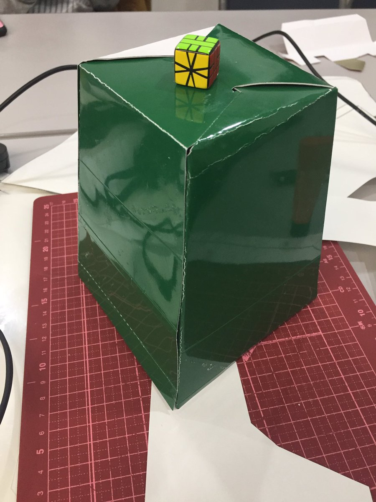
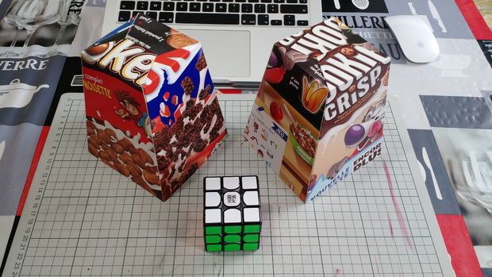
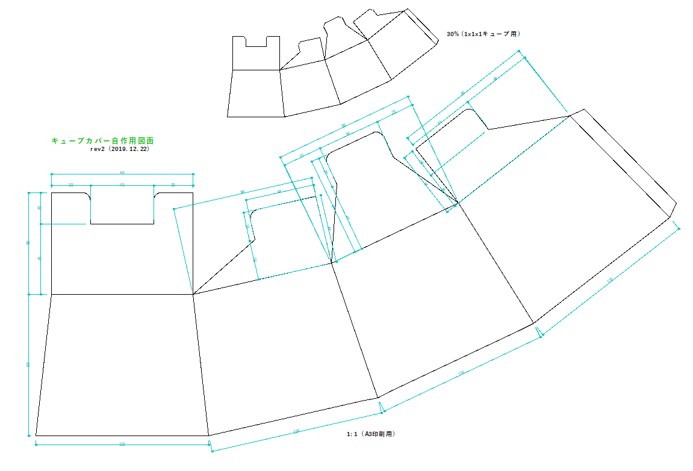
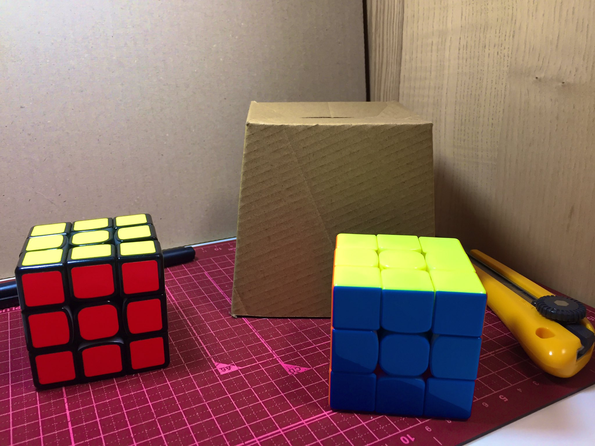
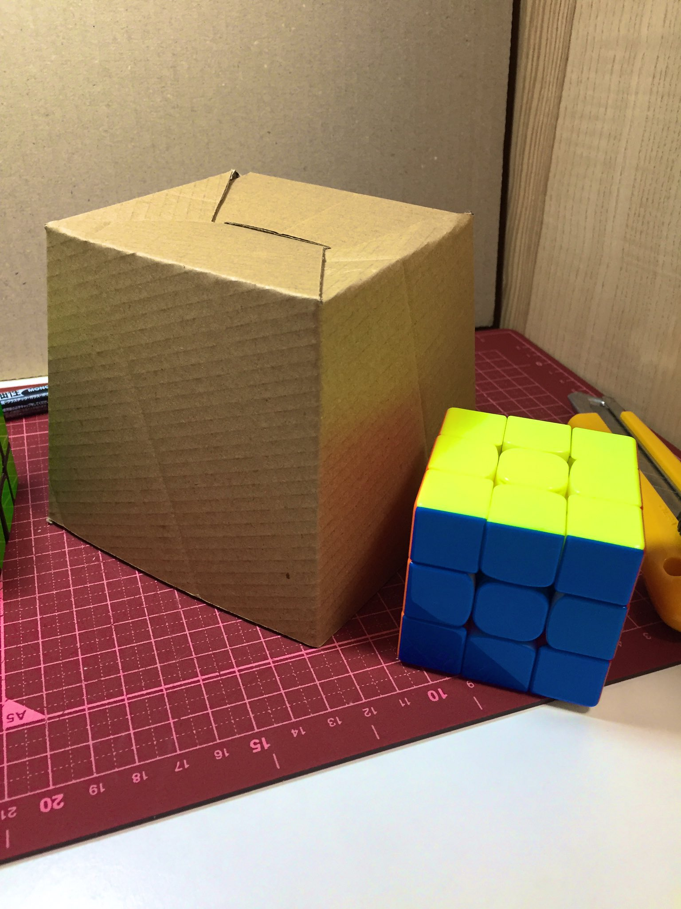
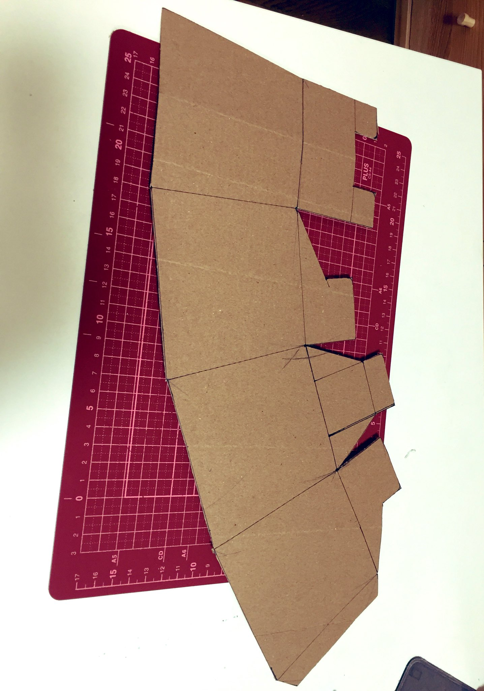
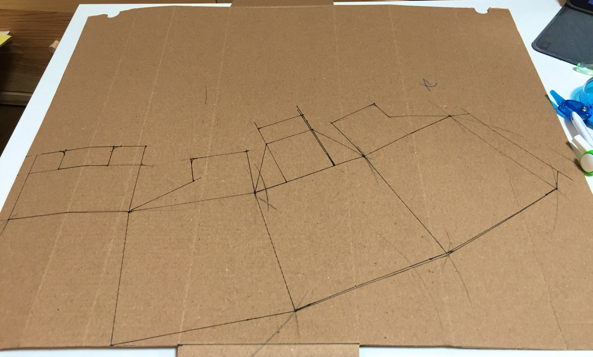

# キューブカバー自作用の図面

## これは何？
スピードキューブにおけるタイム計測のときなどに、キューブをすっぽりと隠すことができるカバーです。先日の首都大クリスマスオフ会のときにこっそりと試作品を作っていました。 **オフ会や計測会などのときに、わかりやすいロゴを入れたキューブカバーを使いたい！** というニーズがあれば、ぜひお使いください。

**もともとはSpeedsolving.comにおいて2017年8月に[Thomas Henrissatによるキュューブカバー用のチュートリアル]((https://www.speedsolving.com/threads/cube-cover-tutorial.66010/))が投稿されており、これを利用して試作品を作りました。** 先人の努力に感謝します！

[非常によくできた作成方法の手順](https://www.instructables.com/id/Twisty-Puzzle-Cover/)が公開されているので、オリジナルのキューブカバーを作りたい場合には彼の記事を読むだけでまったく十分です。上記の外観写真はこの印刷用データを利用したものです。私はクリスマスプレゼントの空き箱を使いましたが、彼はシリアルの空き箱を使ってキューブカバーを作っています。

オリジナルのキューブカバーを作ったところ、かなり大きめのものができました。公式大会に利用されるあらゆるキューブを収納・運搬できるようにするにはちょうどよいサイズかもしれません。しかし、私は少し小さめのものが欲しかったので、同じ構造を採用しつつ、全高を100mmに抑えたものを作ることにしました。

公式大会での利用は想定していませんが、**大会でのキューブカバーにおける「あるべき姿」** については[lgarronがすでにWCA規則に議論において書いていること](https://github.com/thewca/wca-regulations/issues/67)が非常に参考になります。

>I would like to propose a new idea: work with a manufacturer (Meffert's? cube4you?) to create a set of inexpensive puzzle covers / transport containers.
>
>I believe we could solve all or most of the following issues:
>
> - Making sure clocks stand up at the table.
> - Holding different kinds of puzzles comfortably.
> - Keeping puzzles in the container during transport.
> - Keeping the scorecard with the puzzle easily.
> - Keeping the scrambling table organization clean.
> - Easily stacking puzzle containers to clear the table, or making them compact for transport.
> - Possibly indicating the state of the puzzle (new/scrambled/solved/something weird like extra scramble).
> - Keeping the puzzle oriented a specific way when the competitor receives it.
> - Collecting and stacking individual scorecards after competitors are done with their attempts.

TheCubicleやSpeedCubeShopなどのキューブ販売店は、それぞれ同じような構造のキューブカバーを販売しています。ノベルティやおみやげにもちょうどよいかもしれません。型抜きカットして、折り目加工をしてもらうとなると、ある程度のロット数がないと安価には作れないようにも思いますが、DIY的に作るくらいならこれくらいの構造でもよいかもしれません。

## 作り方
下記の印刷用図面をA3用紙に等倍で印刷し、カットします。一か所のみ糊付けすることで組み立てられます。事前に折り目をつけておくと、綺麗に組み立てることができるでしょう。このあたりのテクニックは、上述の[Thomas Henrissatによるチュートリアル](https://www.instructables.com/id/Twisty-Puzzle-Cover/)を見たほうが早いと思います。

薄手の段ボール、お菓子の包装箱などで製作するとしっかりと自立するので、キューブの運搬にも使えます。

## 外観

## ダウンロード
印刷用図面はこちらからご参照ください。

**A3の用紙に印刷すると本来のサイズで出力できます。** 用途に応じて拡大・縮小してお使いください。

- [印刷用図面(pdf)](./pdf/cubecover_forprint_rev2.pdf) 
- [印刷用図面(dxf)](./pdf/cubecover_forprint_rev2.dxf) 

These printing content is licensed CC BY 4.0