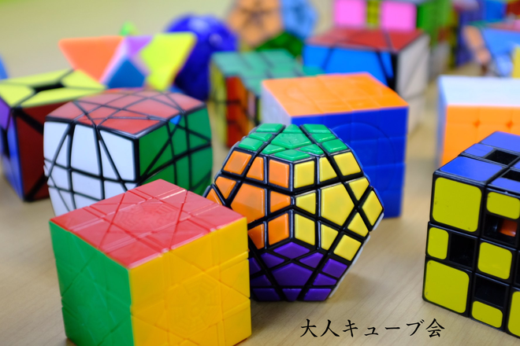

# 大人のためのキューブ勉強会

## これは何？
**大人のためのキューブ勉強会（通称：大人キューブ会）の運営に関するメモ書きです。**

今後開催されるイベントの詳細については、[connpassのイベントページ](https://otonarubik.connpass.com/)をご覧ください！

大人キューブ会とは **キューブパズルが好き！これから好きになりたい！** という大人キューバーが、平日の夜の仕事帰りに集まってキューブを回す会です。  
これまでは、一ヶ月に一回の開催を目処として、月末の木曜日あるいは金曜日ごろに開催していました。

2016年ごろから始まってすでに30回以上開催されています。しかし、もともと主催されていた中島さんがご多忙のため、2019年9月以降、数カ月間開催されていませんでした。大人キューバーで定期的に集まりたい！継続しよう！と思い、私([@kawam1123](https://twitter.com/kawam1123))とsunfield([@sunfield1128](https://twitter.com/sunfield1128))さんで新しく企画を引き継ぎました。（中島さんご自身も、元々の発案者から大人キューブ会を引き継ぐ形で運営していた、とお伺いしています）

## イベントの内容
次のようなことをやる予定です。

### 交流会
参加者同士による自発的な交流会がメインです。ほぼこれが全てです。ほかのキューブイベントと比べたときの特色は、**多くのキューブのイベントは学生が大半を占めますが、この会では大人キューバーしかいない空間で交流ができる点です。**　以前は参加条件に「20歳以上」と書いてあったこともあるようですが、どなたが参加いただいてもよいのではないかと思っています。

交流会を通じて、趣味を同じくするキューブ仲間を増やすことが大きな目的の一つです。社会人になってから新しい人間関係を広げていくのは難しいことで、学生時代からの付き合いでもなく仕事関係でもなく、趣味でつながるコミュニティを見つけて関わっていくのは非常に楽しいことだと思います。**社会人とスピードキューブの関わり方については、ろーだいさんが非常に有益な記事を書いてらっしゃいますので、一読することをおすすめします。**

- [社会人がスピードキューブを続ける意味について roudai.net](http://roudai.net/other/advent-calendar2014/)

なかには相当な玄人もお見えになることがあり、ためになる情報を得られることもしばしばあります。新しいキューブの情報、最新の解法や手順、新しい競技を始める際に読むべきリソース、キューブ用のソフトウェア／ハードウェア、などなど。自分自身のソルブを他の方に見ていただいて、アドバイスをいただくことができるのも大きなメリットがありますし、同じようなタイム帯の参加者を見つけて競い合うのもよいでしょう。

また、参加者がそれぞれ興味のあるキューブパズルを持ってくることが多いので、様々なパズルに触ることができます。実は、私が初めて大人キューブ会に参加して驚いたのはここでした。「おもちゃ屋で見たことがない」どころではなく、そもそも存在すら知らなかったような回転パズルを見ることができるかもしれません。ご自身の珍しいパズルコレクションをお持ちいただく方もいらっしゃいます。

### 解き方レクチャー
希望者がいらっしゃる場合、3x3x3キューブ（ルービックキューブ）の解き方レクチャーを行います。

教材には[Triboxの3x3x3手順書](https://store.tribox.com/products/detail.php?product_id=2643)を利用します。まだ解き方がわからないけど、とにかく3x3x3を解いてみたい方向けです。  
キューブをお持ちでない方のために、入門用のキューブをお貸出しできるように準備する予定です。

### 計測会
WCA公式大会のルールに則った計測会を行います。計測用にスタックマットタイマーを用意しますので、本番の大会に近い環境で練習することができます。  
過去の計測会の記録をGoogle Spreadsheetに保存したものがあるので、これを更新していくことを想定しています。

私自身は、公式大会に参加する前に大人キューブ会に参加して、WCA規則に基づいた計測の方法や、ジャッジをするときに気をつけることなど、様々な情報を得ることができ、非常に助かったのを覚えています。人前で緊張しながらキューブを回すという体験も非常に貴重でした。これは自宅でぼんやりとタイムを測っているだけでは得られないものだと思います。

### 二次会
終了後、多くの場合に二次会（飲み会）を開催しています。**お酒と料理を楽しみながら、さらに参加者と親睦を深めることができます。「大人キューブ会は二次会が本番だ！」と主張する方もいます。**事前に予約しておくこともあれば、当日の参加者の様子を見ながらその場でお店を探すこともあります。イベントページからの申込時に二次会への参加希望を聞いているので、この情報を基にお店を探しておきます。このあたりは大人なので、みなさん幹事経験豊富です。

## 開催履歴
- [大人のためのキューブ勉強会 第37回 (2019/1/20開催予定)](./eventinfo-no37.html)
- 過去の開催履歴は[connpassのイベントページ](https://otonarubik.connpass.com/)をご覧ください。

## 今後の構想とか
もともとはTwitterで「平日の夜にキューバーとの交流会をやりたい」とつぶやいたことがきっかけで、開催することになりました。
<blockquote class="twitter-tweet">
大人キューブ会が開催されなくなって久しいので、「平日の夜の仕事帰りにキューバーで会議室に集まって計測会したり談笑したりする会」を勝手にやろうかなと思うんですが、ニーズありますかね？  山手線の内側で、18:30-20:30くらいを想定。そのあとご飯食べて解散、みたいなの。
&mdash; かわむ (@kawam1123) <a href="https://twitter.com/kawam1123/status/1206926724094541824?ref_src=twsrc%5Etfw">December 17, 2019</a></blockquote> 

どういう会としてやっていきたいのか、どんなふうにすればもっとよくなるのか、アイディアをここに書き溜めておきます。

### 大人キューブ会のメリット
 定期的に大人のキューバーが集まって交流する会が開きたい！というのが最初のアイディアです。  
 若い時からスピードキューブを初めて30代になった方と、30歳を過ぎてからキューブを揃える楽しさに目覚めた方とでは、当たり前のことですが同じ年齢であっても経験や興味の方向が違うと感じています。キューブを始めたころに、何度か大人キューブ会に参加をさせていただいて、同じような興味を持つ方がいることを知って安心しつつ嬉しく思いました。回転パズルを解くことやスピードキューブ競技にのめりこんで、**平日の仕事帰りの貴重な時間を費やしてまでキューブを回したい！と思うような強い興味を持つ方がそれなりにいるのです。**

 また、これまで行われていた大人キューブ会について、私が特にメリットがあると感じたのは以下の点です。
- 同じような趣味を持つ知り合いができる。他のキューブコミュニティや大会などに参加したときに、知り合いがいるというのはそれだけで安心があった。
- 大会形式の計測会に参加し、自分のソルブを（自分より上手な人に）見てもらえる。（中島さんは日本人唯一の3x3x3世界チャンピオンでもあり、さまざまなレベルのソルブを見慣れてらっしゃったため、アドバイスも適格でした）
   - 私はたかだかsub-20程度のキューバーなので、これをそのまま実践するのは私だけでは無理。
- **「こんなパズルが触ってみたい／買いたい」と事前に伝えると、持ってきてくれる。**　Triboxのちから。
 
### 気を付けたいこと
**どんなレベルの参加者がいても得るものがある会にしたいと思ってます。**

初心者は自分のソルブのレベルアップにつながるので、こういう会に参加することで非常に多くのものが得られるでしょう。交流会を通じて他の人のアドバイスをいただきたい！という強いモチベーションがあるからです。上級者からの一方的な搾取にならないように注意しなければならないと思っています。**参加する方がどんなレベルの、どんな興味のあるキューバーであっても「いい時間を過ごすことができた！参加してよかったなあ！」と思って帰ることができるようにしたいのです。**どんな風にすればそれが実現できるのかは、これから回数を重ねて行きながら、考え続けていかなければならないと思っています。

たとえば、YRCC（与野ルービックキューブサークル）さんにお邪魔すると、これが自然にできているので素晴らしいと感じます。計測会があって、初心者向けのオンデマンドのレクチャーがあって、さらに目隠しの発展的な解法についての議論をしたい方は自然と集まっている。…というように外からは拝見しています。

特にスピードキューブにおいては、**みんながそれぞれ違う段階にいて、違う背景を持って取り組んでいる**という構造があり、みんなが同じレベルではないから、実際にソルブを見たり離したりしてみないと、できるアドバイスが少ないということがあると思います。マンツーマン形式でトレーニングを受けるのが上達の近道なんでしょう。ライザップみたいな。

### その他
場所、参加費、告知など、いろいろやりながら考えていきます。